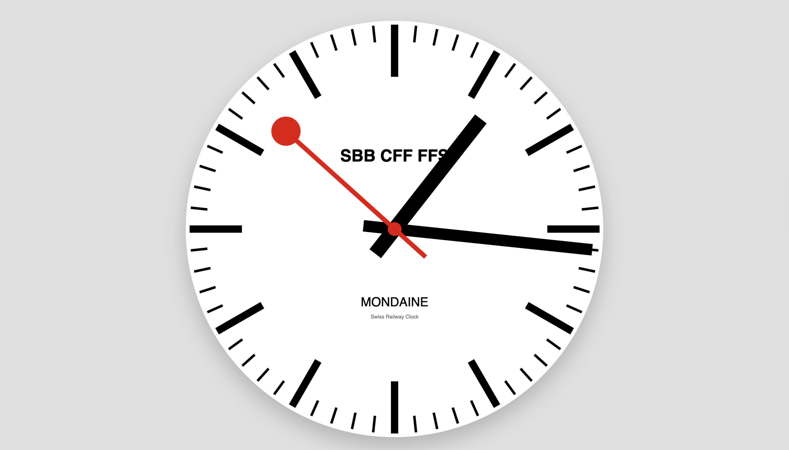

# Mondaine Swiss Railway Clock 🇨🇭

A **responsive, Mondaine-style Swiss Railway Clock** built with **pure HTML, CSS, and JavaScript** using the HTML5 Canvas API.

This project faithfully reproduces the iconic **SBB railway clock behavior**, including the smooth sweeping second hand, the characteristic **1.5-second pause at 12**, and the delayed minute jump — all while scaling perfectly to any screen size.

